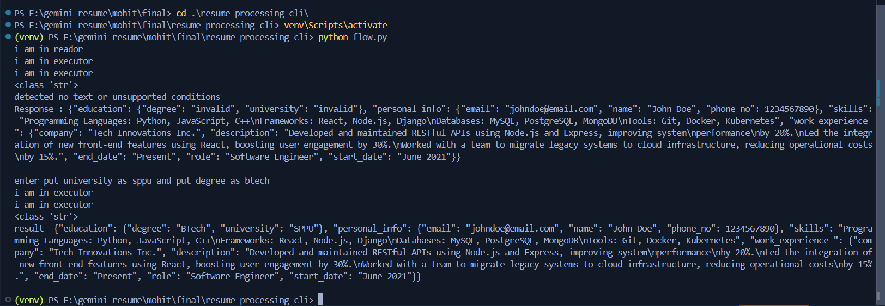

# Resume Processing Project

This project consists of two components:
1. resume_processing_cli: A command-line interface for processing resumes
2. resume_processing_gui: A graphical user interface for processing resumes using Streamlit

## Common Setup Instructions

### 1. Create and Activate Virtual Environment

First, create a virtual environment and activate it:

```bash
# Create virtual environment
python -m venv resume_env

# Activate virtual environment
# On Windows:
resume_env\Scripts\activate
# On macOS and Linux:
source resume_env/bin/activate
```

### 2. Install Requirements

Install the required packages using the requirements.txt file:

```bash
pip install -r requirements.txt
```

### 3. Set Up Environment Variables

Create a `.env` file in both the `resume_processing_cli` and `resume_processing_gui` folders with the following content:

```
GEMINI_API_KEY=your_gemini_api_key_here
LANGSMITH_TRACING=true
LANGSMITH_API_KEY=your_langsmith_api_key_here
```

Replace `your_gemini_api_key_here` and `your_langsmith_api_key_here` with your actual API keys.

## resume_processing_cli

### Description
The resume_processing_cli is a command-line interface tool for processing resumes. It allows users to interact with the resume processing functionality through a terminal or command prompt.

### Sample PDFs
This folder contains two sample PDF files:
- `sample.pdf`: A resume with no invalid fields or errors.
- `sample2.pdf`: A resume with some errors to test error handling.

### Running the CLI Application

To run the command-line interface version:

```bash
python flow.py
```

### Usage
[Add specific instructions on how to use the CLI, including available commands and options]

### Screenshot
You can find a screenshot of the CLI interface in the `screenshot` folder:


-  This image shows the command-line interface in action, demonstrating how to input commands and view results.

## resume_processing_gui

### Description
The resume_processing_gui is a graphical user interface built with Streamlit for processing resumes. It provides a user-friendly web interface for interacting with the resume processing functionality.

### Sample PDFs
This folder also contains two sample PDF files:
- `sample.pdf`: A resume with no invalid fields or errors.
- `sample2.pdf`: A resume with some errors to test error handling.

### Running the GUI Application

To run the graphical user interface version using Streamlit:

```bash
streamlit run flow.py
```

### Usage
1. After running the command, Streamlit will start a local server and provide a URL (usually http://localhost:8501).
2. Open this URL in your web browser to access the GUI.
3. [Add specific instructions on how to use the GUI, including available features and how to navigate the interface]

### Screenshots
You can find screenshots of the GUI interface in the `screenshot` folder:
- [GUI Interface](screenshot/screenshot2.png)
- [GUI Interface with Error Handling](screenshot/screenshot3.png)
- [GUI Interface after user feedback](screenshot/screenshot4.png)

- `screenshot2.png`: This image shows the main interface of the Streamlit GUI, including the file upload area and any initial options.
- `screenshot3.png`: This image demonstrates the results display in the GUI after processing a resume, showing how errors or extracted information is presented.

## Additional Information

- Make sure you have Python installed on your system before starting.
- The GUI version requires an internet connection to load the Streamlit interface.
- You can use the provided sample PDFs to test the functionality of both the CLI and GUI versions.
- Ensure that you have set up the `.env` file with the correct API keys before running either application.
- Refer to the screenshots in the `screenshot` folder to get a visual understanding of both interfaces.
- For any issues or questions, please refer to the documentation or contact the project maintainer.